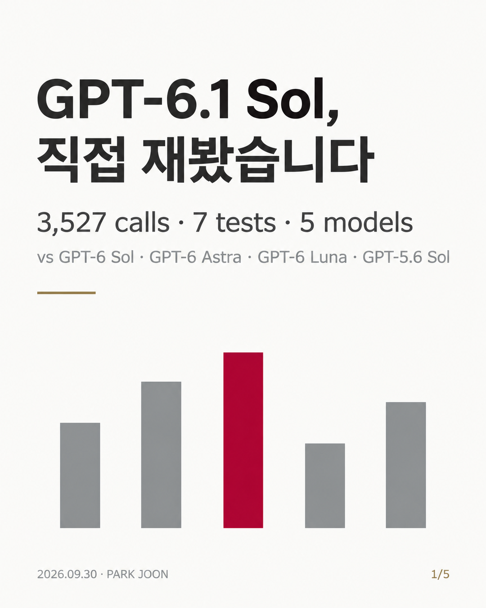
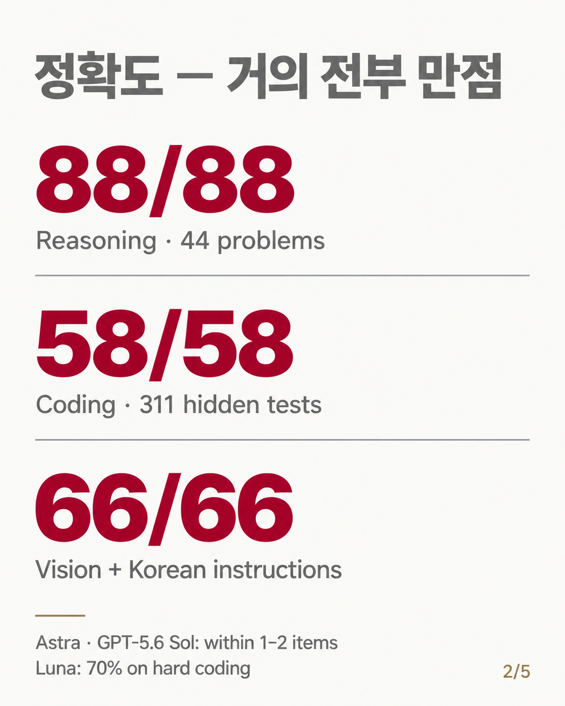
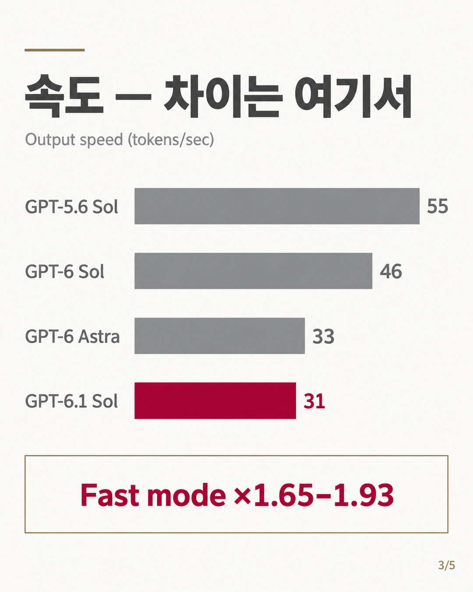
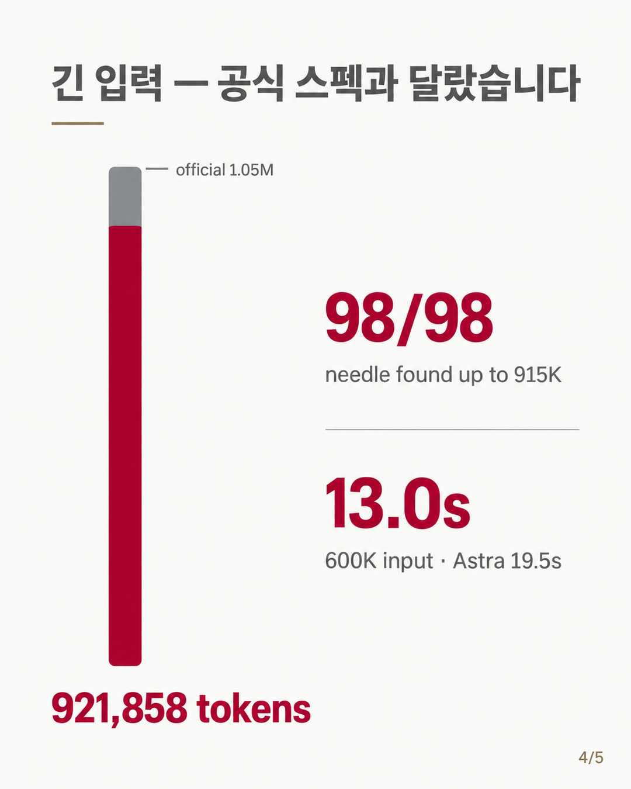
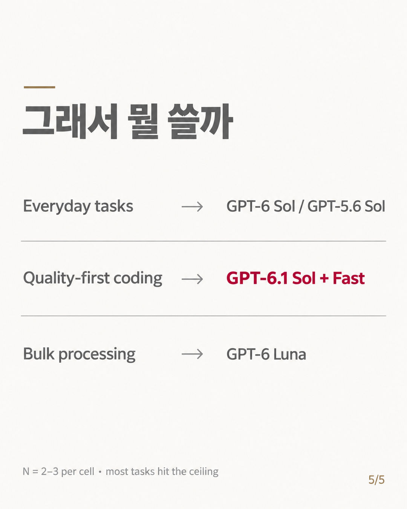

# gpt-6.1-sol benchmark (2026-09-30)



## English summary

Measured on 2026-09-30 in the Codex environment of a ChatGPT Pro subscription. gpt-6.1-sol (released 2026-09-29) vs gpt-6-sol, gpt-6-astra, gpt-6-luna and gpt-5.6-sol, 3,527 API calls across 7 tracks. This repo contains **data only** (task definitions, per-call scores, summaries). No harness code, no hidden tests, no full model responses.

- **Accurate.** Reasoning (44 problems x 2): 88/88 at effort high. Coding (29 tasks x 2, hidden tests): 58/58. Vision + Korean instruction following: 66/66 cells. Function calling, agent loop and JSON output: full marks.
- **But not separable from the top tier.** gpt-6-astra and gpt-5.6-sol land within 1-2 items on every accuracy track. Most tracks hit the ceiling; gpt-6-luna scored lower (e.g. 14/20 on the hardest coding tier), and its reasoning score is the only one whose 95% CI separates from gpt-6.1-sol (high effort).
- **Slow.** Visible streaming speed is about 31 tok/s (gpt-6-astra 33, gpt-6-sol 46, gpt-6-luna 49, gpt-5.6-sol 55). At effort max the reasoning prompt took 53.5 s (gpt-6-sol 22.6 s).
- **Effort scales reasoning tokens monotonically** (low to max: 283 to 1,399 tokens, x4.94, Spearman 1.00), with no accuracy gain observed on these tasks.
- **Fast mode.** `service_tier: "priority"` gave x1.65-x1.93 tok/s.
- **Long context.** Max accepted input was 921,858 tokens (same as gpt-6-sol and gpt-6-astra). Needle retrieval 98/98 from 16K to about 914K. At 600K input, median response time 12.95 s (gpt-6-sol 14.37 s, gpt-6-astra 19.52 s).
- **Caveats.** N = 2-3 per cell, ceiling effects on most tracks, and numbers come from a subscription environment, so they may differ from the official API.

---

## 한 줄 결론

**gpt-6.1-sol 은 정확하지만 느린 모델입니다.** 정확도는 최상위권이지만 gpt-6-astra·gpt-5.6-sol 과 구분되지 않았고, 차이는 속도에서 났습니다.

- 측정일: 2026-09-30 (gpt-6.1-sol 출시 다음 날)
- 환경: ChatGPT Pro 구독의 Codex 환경
- 대상: gpt-6.1-sol / 비교군: gpt-6-sol(직전 Sol), gpt-6-astra(상위 모델), gpt-6-luna(저가형), gpt-5.6-sol(이전 세대)
- 규모: 7개 트랙, API 호출 3,527회[^calls]
- 실험 설계·실행·채점은 Claude Code 에이전트로 진행했고, 채점은 전부 규칙 기반(정답 대조·숨김 테스트 실행·스키마 검증)입니다. LLM 판정은 쓰지 않았습니다.

이 레포에는 **데이터만** 있습니다. 문제 정의, 호출 단위 채점 결과, 요약표, 그래프입니다. 실험 코드, 채점기 코드, 숨김 테스트, 모델 응답 원문은 넣지 않았습니다. 응답에서는 채점에 쓴 짧은 파싱값(최종 답, 비전 필드값, 제약 통과 여부 등)만 남겼습니다.

[^calls]: 3,527회에는 raw 기록이 없는 사전 점검 6회가 포함됩니다. 툴 트랙 1,346회 가운데 실행 환경 확인용 진단 호출 60회는 모델 특성을 재는 호출이 아니어서 공개 데이터에서 제외했습니다. 공개 데이터의 툴 트랙은 1,286회분입니다. Fast 모드 67회 가운데 `service_tier` 추가 값 확인용 6회도 같은 이유로 제외해 공개분은 61회입니다.

## 무엇을 테스트했나

| 트랙 | 과제 수 | 반복 | 호출 | 채점 방식 | 데이터 |
|---|---|---|---|---|---|
| 속도 (effort 스케일링) | 프롬프트 3종 × effort 5단계 | 셀당 3 | 253 (본 실험 225) | TTFT·총시간·추론토큰·가시 tok/s 측정, 셔플 실행 | [data/speed](data/speed/) |
| Fast 모드 | 프롬프트 2종 × `service_tier` | 짝당 3 | 61 (공개분) | 기본·Fast 호출을 짝으로 연달아 실행, 짝별 tok/s 배율 | [data/speed](data/speed/) |
| 추론 (수학·논리) | 44문항 | 2 (medium·high) | 884 | 마지막 `ANSWER:` 줄을 정답과 분수 동치 비교 | [data/reasoning](data/reasoning/) |
| 코딩 | 29과제 (core19 + extreme10) | 2 | 419 | 숨김 테스트 311개 실행, pass@1 + 수리 루프 + effort 스윕 | [data/coding](data/coding/) |
| 툴 사용 | FC 30시나리오 · 에이전트 8과제 · JSON 15케이스 | 2 | 1,286 (공개분) | 호출 집합 대조, 최종 답 대조, JSON Schema 검증 | [data/tools](data/tools/) |
| 롱 컨텍스트 | 입력 상한 · NIAH 16K~915K · 복합 과제 3종 · 600K 지연 | 1~3 | 228 | 정답 코드 포함 여부, 합계 정수 일치, 갱신값 분류 | [data/longctx](data/longctx/) |
| 비전·한국어 | 비전 17과제 + 한국어 지시 준수 16과제 | 2 | 330 | 필드별 정답 대조, 한국어 형식 제약 48개 규칙 판정 | [data/vision_ko](data/vision_ko/) |

롱 컨텍스트 트랙은 gpt-6.1-sol · gpt-6-sol · gpt-6-astra 세 모델만 쟀습니다.

## 성적표 요약

gpt-6.1-sol 열이 대상 모델입니다. 트랙별 상세와 출처 파일은 [SCORECARD.md](SCORECARD.md) 에 있습니다.

| 지표 | **gpt-6.1-sol** | gpt-6-sol | gpt-6-astra | gpt-6-luna | gpt-5.6-sol |
|---|---|---|---|---|---|
| 추론 44문항 정답 (effort high) | **88/88** | 86/88 | 86/88 | 76/88 | 86/87 |
| 코딩 pass@1 (29과제 × 2) | **58/58** | 57/58 | 58/58 | 52/58 | 58/58 |
| 코딩 extreme10 pass@1 | **20/20** | 19/20 | 20/20 | 14/20 | 20/20 |
| function calling strict (기본 40 + 어려운 20) | **60/60** | 60/60 | 60/60 | 60/60 | 60/60 |
| 에이전트 8과제 | **16/16** | 16/16 | 16/16 | 16/16 | 16/16 |
| 비전 + 한국어 만점 셀 | **66/66** | 64/66 | 66/66 | 62/66 | 65/66 |
| 가시 스트리밍 tok/s (중앙값) | **31.1** | 46.0 | 33.0 | 49.2 | 54.9 |
| reasoning 총시간 effort low → max (초) | **17.6 → 53.5** | 9.4 → 22.6 | 18.7 → 44.0 | 19.9 → 41.0 | 14.3 → 24.5 |
| Fast 모드 tok/s 배율 (250단어 / 600단어) | **×1.65 / ×1.93** | ×1.91 / ×1.87 | ×1.58 / ×1.52 | ×2.48 / ×1.56 | ×1.32 / ×1.73 |
| 최대 수락 입력 토큰 | **921,858** | 921,857† | 921,858 | 측정 안 함 | 측정 안 함 |
| 600K 입력 응답 시간 중앙값 (초) | **12.95** | 14.37 | 19.52 | 측정 안 함 | 측정 안 함 |

† gpt-6-sol 은 921,858 을 시험하지 못했고(토크나이저 계수 차이), 921,859 는 세 모델 모두 거부했습니다.

읽는 법: 정확도 행은 상위 4개 모델(6.1-sol · 6-sol · astra · 5.6-sol)이 1~2건 차이라 **구분 불가**입니다. gpt-6-luna 는 추론·코딩에서 낮게 관측됐지만, 95% 신뢰구간이 gpt-6.1-sol 과 분리되는 것은 추론 high 한 쌍(luna 상한 0.920 < 6.1-sol 하한 0.958)뿐입니다. 코딩(luna 52/58)은 신뢰구간이 겹칩니다. 속도 행은 셔플 실행한 속도 트랙 값이라 모델 간 비교 근거로 씁니다.



## 트랙별 결과

### 속도 · Fast 모드 — [data/speed](data/speed/)

가시 스트리밍 속도는 약 31 tok/s 로 effort·프롬프트가 바뀌어도 거의 일정했습니다. gpt-6-astra(33.0)와 같은 대역이고 gpt-6-sol·gpt-6-luna·gpt-5.6-sol(46~55)보다 느렸습니다. effort 를 올리면 reasoning 프롬프트의 추론토큰이 283 → 1,399 로 단조 증가했고(×4.94, Spearman 1.00), max 총시간 53.5초는 5개 모델 중 가장 길었습니다. 다만 astra(×4.11)·6-sol(×3.99)도 Spearman 1.00 이라 "effort 를 가장 잘 따르는 모델"로 가를 근거는 없습니다. 이 문제는 low 에서 이미 3/3 정답이라 effort 를 올린 정확도 이득은 관측되지 않았습니다. Fast 모드(`service_tier: "priority"`)는 tok/s 를 ×1.65(250단어)~×1.93(600단어) 올렸고, 600단어 총시간이 33.6초 → 16.6초로 줄었습니다.



### 추론 — [data/reasoning](data/reasoning/)

직접 만든 44문항(easy 10 · medium 10 · hard 14 · xhard 10)에서 gpt-6.1-sol 은 high 88/88, medium 86/88 이었습니다. medium 의 오답 2건은 둘 다 H04(1,000번 소수 판정을 도구 없이 해야 하는 문항)였습니다. 상위 4개 모델 8개 셀이 84~88건에 몰려 있어 구분 불가이고, gpt-6-luna(medium 72/88, high 76/88)는 낮게 관측됐습니다. 신뢰구간이 분리되는 것은 luna high(상한 0.920)와 gpt-6.1-sol high(하한 0.958) 한 쌍뿐이고, luna high 는 gpt-6-sol·gpt-5.6-sol medium 과는 겹칩니다. H04 를 뺀 medium 평균 추론토큰은 gpt-6.1-sol 179개로, gpt-6-sol 286 · gpt-5.6-sol 373 보다 적고 gpt-6-astra 149 보다는 많았습니다.

### 코딩 — [data/coding](data/coding/)

명세만 주고 숨김 테스트로 채점했습니다. 교과서형 19과제(core19)는 5개 모델 모두 38/38 로 천장이었고, 명세 조항을 촘촘히 건 10과제(extreme10)에서 gpt-6-luna 14/20, gpt-6-sol 19/20 만 떨어졌습니다. gpt-6.1-sol 은 effort low·medium·high·xhigh 네 구간 모두 extreme10 20/20 이었고, 다른 모델이 틀린 코드 7건을 2회씩 고치게 한 14시도도 전부 성공했습니다(astra 도 14/14). 만점 3개 모델 간 차이는 토큰에서 났습니다. extreme10 평균 추론토큰이 astra 183 · 6.1-sol 353 · 6-sol 680 · 5.6-sol 1,330 이었습니다.

### 툴 사용 — [data/tools](data/tools/)

가짜 툴 5종(날씨·환율·일정·DB·계산기)으로 function calling 30시나리오, 3~5단계 에이전트 8과제, JSON 구조화 출력 15케이스를 돌렸습니다. 5개 모델 모두 function calling·에이전트 만점이고, 툴이 필요 없는 질문에서 부른 경우도 없었습니다. JSON 은 gpt-6-luna prompt 모드 값 오답 1건(27/28)을 빼면 전부 만점입니다. 이 난이도에서는 정확도로 모델을 가를 수 없습니다(천장 효과). 툴 턴 지연 중앙값(gpt-6.1-sol 3.38초)은 모델별 블록 순서로 실행해 순위 근거로 쓰지 않습니다.

### 롱 컨텍스트 — [data/longctx](data/longctx/)

이 환경에서 gpt-6.1-sol 이 받는 입력 상한은 921,858 토큰이었고 921,859 부터 `context_length_exceeded` 로 거부됐습니다. 공식 표기(1.05M)와 다른 값이고, 차이의 원인은 검증하지 않았습니다. 16K~915K 단일 NIAH 는 98/98, 5개 동시 회수·숫자 20개 합계·방해 메모가 섞인 최신값 추적도 유효 호출 전부 정답이었습니다. 비교군도 천장이라 정확도로는 구분되지 않습니다. 세 모델을 번갈아 호출한 600K 지연 비교에서 총시간 중앙값은 6.1-sol 12.95초, 6-sol 14.37초(범위가 겹쳐 같은 급), astra 19.52초였습니다.



### 비전 · 한국어 지시 준수 — [data/vision_ko](data/vision_ko/)

합성 이미지 17장(차트·개수 세기·OCR·도형)과 형식 제약이 붙은 한국어 프롬프트 16개입니다. gpt-6.1-sol 은 비전 34/34, 한국어 32/32 로 66셀 전부 만점이었습니다. 다만 330셀 중 323셀이 만점인 천장 트랙이라 astra(66/66) · 5.6-sol(65/66) · 6-sol(64/66)과는 구분 불가입니다. 추론토큰 중앙값이 0 이었는데도 총시간 중앙값(비전 4.65초, 한국어 6.09초)은 5개 모델 중 가장 길었습니다. 이 트랙은 투입 순서상 6.1-sol 이 과제마다 늘 첫 번째였고 두 시간대가 섞여 있어 지연은 참고값입니다.

## 용도별 추천

아래는 관측을 바탕으로 한 제 해석입니다. 과제 대부분이 천장에 걸린 상태에서 나온 판단이라, 더 어려운 과제에서는 달라질 수 있습니다.

| 용도 | 추천 | 근거 |
|---|---|---|
| 일상 업무 (요약·메일·가벼운 코드) | gpt-6-sol, gpt-5.6-sol | 정확도는 구분 불가, 가시 tok/s 46~55 로 더 빠름 |
| 까다로운 코딩, 품질 우선 | gpt-6.1-sol + Fast 모드 | extreme10 20/20, 교차 수리 7건×2회 14/14. Fast 로 ×1.65~1.93 |
| 90만 토큰급 긴 입력 | gpt-6.1-sol 또는 gpt-6-sol | 600K 응답 12.95초 / 14.37초, astra 19.52초 |
| 대량 처리 (단순 작업) | gpt-6-luna | 빠르지만 어려운 추론·코딩에서 확실히 떨어짐 (xhard 11/20, extreme10 14/20) |
| effort 설정 | 이 수준 문제라면 low~medium | effort 를 올려도 정확도 이득은 관측되지 않았고 시간만 늘었음 |



## 한계

- **표본이 작습니다.** 셀당 반복 N=2~3 이 대부분입니다. 1~2건 차이는 구분 불가로 적었고, 만점은 "이 N 에서 실패가 없었다"는 뜻이지 실패율 0 의 증명이 아닙니다.
- **천장 효과.** 코딩 core19, 툴 트랙, 비전·한국어, 롱 컨텍스트 회수 과제는 상위 모델이 거의 모두 만점이었습니다. "astra 에 가까운 성능"이라는 주장을 제대로 가르려면 더 어려운 문제 세트가 필요합니다.
- **구독 환경 측정.** 모든 값은 ChatGPT Pro 구독의 Codex 환경에서 잰 것입니다. 공식 API 의 지연·처리량·입력 한도·툴 동작과 다를 수 있습니다. 여러 트랙을 같은 시간대에 돌려 대기열 지연이 섞였을 수 있습니다. 모델 간 속도 비교는 셔플했거나(속도 트랙) 번갈아 호출한(롱 컨텍스트 600K) 결과만 근거로 삼았습니다.
- **데이터 품질: 끊긴 응답.** 응답 도중 네트워크가 끊겨 완료 신호와 토큰 사용량이 오지 않은 기록이 있었습니다. 오답이 아니라 관측 실패로 보고 다음과 같이 처리했습니다. 트랙별 README 에 같은 내용을 적었습니다.

  | 트랙 | 끊긴 기록 | 처리 |
  |---|---|---|
  | 속도 (effort) | 0 / 225 | — |
  | Fast 모드 | 1 / 61 | 재호출본으로 교체. 원기록은 `used_in_summary=false` |
  | 추론 | 5 / 884 | 분모에서 제외, 재실행 성공분 사용. 1셀은 재실행도 끊겨 값 없음(`observed=false`) |
  | 코딩 | 4 / 374 (생성 호출) | 채점 제외, 같은 조건 재시도 결과 사용 |
  | 툴 | 3 (gpt-5.6-sol JSON strict) | 채점·지연 집계에서 제외 |
  | 롱 컨텍스트 | 2 / 228 | 채점 제외(`valid=false`), 재호출 안 함 → 400K 과제 유효 N=2 |
  | 비전·한국어 | 0 / 330 | — |

- **채점 수정 2건.** 코딩 정규식 과제의 성능 테스트가 명세보다 엄격해 `"x"*5000` → `"x"*200` 으로 바꾸고 저장된 코드를 재채점했습니다. 한국어 명사형 종결 판정이 "꼽힘"을 놓친 오판 1건을 고쳐 재채점했습니다(gpt-6-sol 1셀). 두 경우 모두 모델을 다시 호출하지 않았습니다.
- **사후 추가 과제.** 추론 xhard 10문항과 코딩 extreme10 은 1차 결과가 천장에 붙은 것을 보고 나중에 추가했습니다.

## 폴더 구조

```
gpt-6.1-sol-benchmark/
├── README.md              이 문서
├── SCORECARD.md           성적표 한 장 (지표 × 모델, 출처 파일 표기)
├── LICENSE                CC BY 4.0
├── images/                요약 이미지 5장 (01_cover ~ 05_guide)
└── data/
    ├── speed/             effort 스케일링 225회 + Fast 모드 61회, 그래프 2장
    ├── reasoning/         문항 44개, 결과 880행, 요약
    ├── coding/            과제 29개(명세), 첫 시도 370행, 수리 42행, 요약
    ├── tools/             툴 정의·픽스처, FC 300행, 에이전트 80행, JSON 300행, 요약
    ├── longctx/           NIAH 128행, 한도 탐색 42행, 복합 과제 51행, 600K 지연 9행, 요약
    └── vision_ko/         비전 과제 17개 + 이미지, 한국어 과제 16개, 결과 330행, 요약
```

각 `data/<track>/README.md` 에 테스트 내용, 방법, 결과, 컬럼 설명이 있습니다. CSV 는 모두 UTF-8, 헤더는 영문 snake_case 입니다.

## 라이선스 · 인용

데이터와 문서는 [CC BY 4.0](LICENSE) 으로 공개합니다. 출처(PARK JOON, joonlab)와 레포 링크를 밝히면 자유롭게 쓰고 고쳐도 됩니다.

```
PARK JOON (joonlab). gpt-6.1-sol benchmark: accuracy, speed, long context, tools, vision and Korean
instruction following vs gpt-6-sol, gpt-6-astra, gpt-6-luna, gpt-5.6-sol. 2026-09-30.
https://github.com/joonlab/gpt-6.1-sol-benchmark
```

```bibtex
@misc{park2026gpt61sol,
  author       = {PARK JOON},
  title        = {gpt-6.1-sol benchmark (2026-09-30)},
  year         = {2026},
  howpublished = {\url{https://github.com/joonlab/gpt-6.1-sol-benchmark}},
  note         = {Data only. Measured in the Codex environment of a ChatGPT Pro subscription.}
}
```

모델 이름과 제품명은 각 권리자의 것입니다. 이 레포는 OpenAI 와 관계없는 개인 측정 기록입니다.
